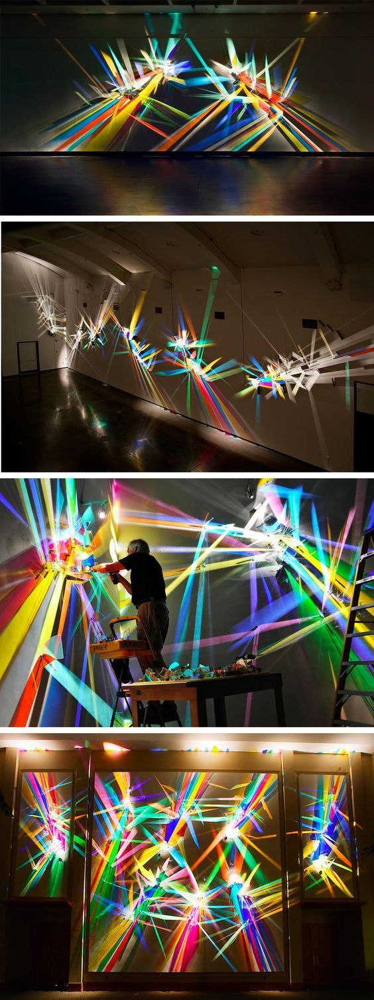

## Concept After First Presentation

(initial idea in **Week04 Lab Report**)

The initial concept for the final project is to create a atmospheric divice that respond to changes in evironment. Inputs should be hidden (embeded in the device or inserted in the room which exhibits) and changes of output may be subtle hence the whole device is part of the indoor space.

(Week06) After discussion with tutor, I decided to make the device more playful and encouraging people to engage as well as keeping the "killing part" of making the output effect "big" and atmospheric.

## Appearance of Device

### Form
(Week05)

*Design Process*

(Week06) Inspired by Stephen Knapp's art work [Fig], I am intending to make such an art work of light and colour that helps defining the character of space. Ideally, the component can be mounted onto a tall self-standing board that acts as a "fake wall" in the room. This idea has to have supporing tools, materials and spaces.

*Fig01: Stephen Knapp, Light Paintings*

Start with a smaller version to test.

### Materials & Components

(Week06)

- SWITCH!!!

- Relay light bulb

- Coloured acrylic panel/sheet

- Speaker(optional)

- Servo for rotation

- Sensors––sound, blow

- Press/tactile Button

## Ways to Interact

(Week06) 

- blow––light switch

- noise––light brightness

- button––sound+rotation