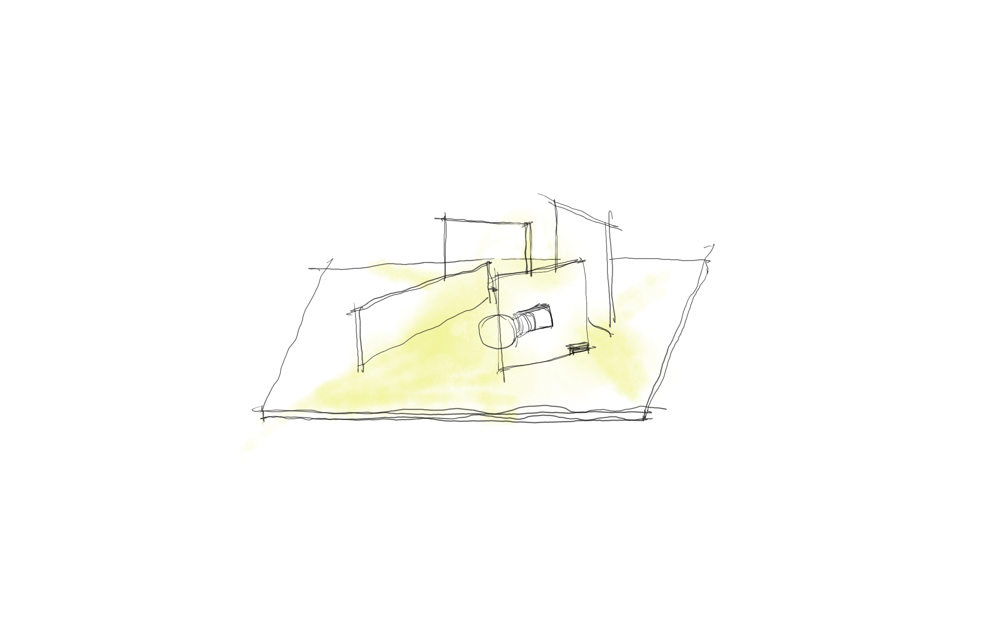

## Concept After First Presentation

(initial idea in **Week04 Lab Report**)

The initial concept for the final project is to create a atmospheric divice that respond to changes in evironment. Inputs should be hidden (embeded in the device or inserted in the room which exhibits) and changes of output may be subtle hence the whole device is part of the indoor space.

(Week06) After discussion with tutor, I decided to make the device more playful and encouraging people to engage as well as keeping the "killing part" of making the output effect "big" and atmospheric.

## Form

#### Initial Idea

*Design Process*

#### Precedents

Inspired by Stephen Knapp's art work [Fig], I am intending to make such an art work of light and colour that helps defining the character of space. Ideally, the component can be mounted onto a tall self-standing board that acts as a "fake wall" in the room. This idea has to have supporing tools, materials and spaces.

*Fig01: Stephen Knapp, Light Paintings*

lighting on acrylic panel

##### Start with a smaller version to test

1st stage outcome---not neat enough to me

used 3D printed components

The box-like version tends out to be to complex in structures, which keeps away from my imagination of a 'simple but powerful' design.

#### adaptation of plan

Try to keep make the design look like a device on a flat surface and minimise room for 'functions'. However, there have to be a room for all electrical parts, the thickness of base is inevitable.

Station for all sensors, which can be placed away from the main sturctures to really detect movements in a room.(which proved to be problematic in terms of seneor properties.)

## Materials & Components

- SWITCH (needed as a proper usable device)

- Relay light bulb (replaced by DMX dimmer box)

- Coloured (transparent) acrylic panel/sheet

- Speaker(optional)

- Servos for rotation

- Sensors––sound, blow

- Press/tactile Button (to ingage)

- 3D print connecting compoents with screws(did not use)

## Ways to Interact
 
- blow––light switch

- noise––light brightness

- button––sound+rotation

##### Final Decisions

- Sound––Brightness of light bulb

- Ditance sensors––ratation of Acrylic

## Reference

- Stephen Knapp, Light Paintings

- Karakuri: How to Make Mechanical Papers That Move.

