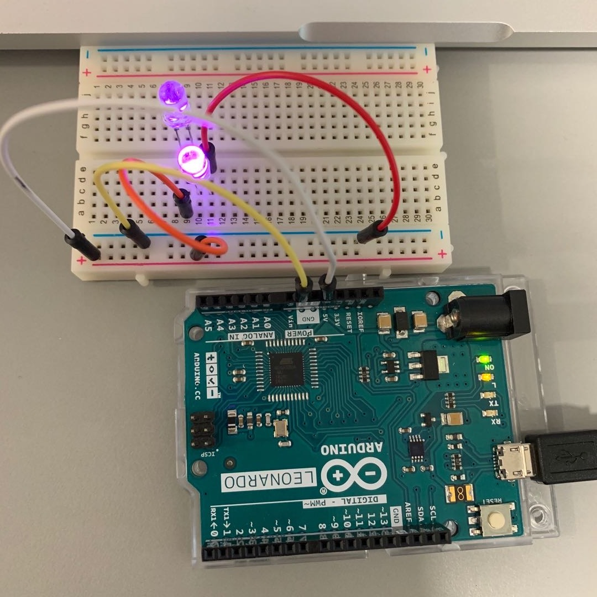

## Week 02 Lab Report

### Lab 00 - Leds in Serial and Parallel

Experiment results: Maximum 2 White LEDs in serial and more than 24 in parallel.

This lab experiment discuss about the load of a circuit. My computer output is 5V,4.5W and a battery is 1.5V, max.2.4W. I learned to always keep in mind the voltage and maximum power of a power source of a device.

*Two LEDs on in serial.*

*Three LEDs off in serial.*

*24 LEDs on in parallel.*

### Lab 01 - Serial Data
###### A little Wee Story
void setup() {

   Serial.begin(9600); 

   Serial.println("Tell me what you think");
  
}

void loop() {
  
 if(Serial.available()) 

 { int a = random(0,3);

   String message[ ] = {"hello  ", "thanks  ", "haha  "};
  
   Serial.print(message[a]); 

  String s = Serial.readString(); 

   Serial.println(s); 

 }

### Lab 02- Potentiometers (Knobs)

A potentiometer is useful in directly changing the resistance in a circuit. The example inspires me a lot in converting the change of resistance into change in digital signals, ie, time intervals.

### Lab 03 - Light Dependent Resistors

An LDR detects the surrounding lighting and changes its resistance. I powered up the circuits and played with the light in relation to the input data.

### Lab 04 - Playing with Common Sensors

My team  received temperature sensor TMP36 for this session. I built up the two circuit as the link on wesite shows. And use the code online to test how the sensor works.

The temperature sensor detects tempterature and act as a votage divider, the output of 'middle leg' varies due to temperature. Temperature is calculated mathematicaly. I tested with temperature from room temperature (about 25˚C) to hot water about (80˚C).

The temperature sensor is connected to 5V and 3.3V respectively. 5V is the default voltage and I learned to set external reference voltage of 3.3V in codes. 

Issues I faced include the abnormal heating of the sensor. This issue occurs twice and was solved after reconnecting the same circuit. I need to be prepared to disconnect immediately the next time I use this TMP36 sensors.