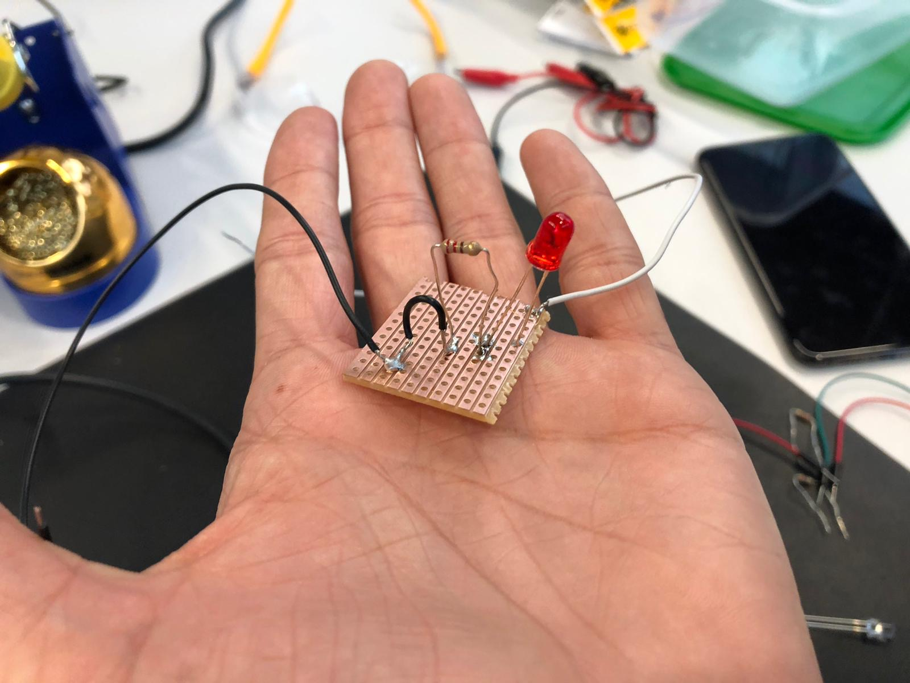
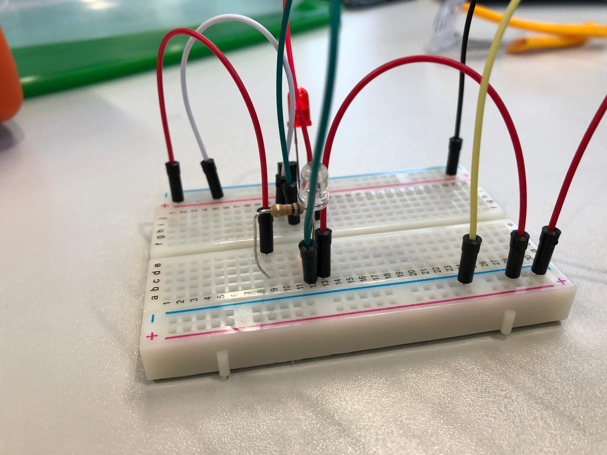
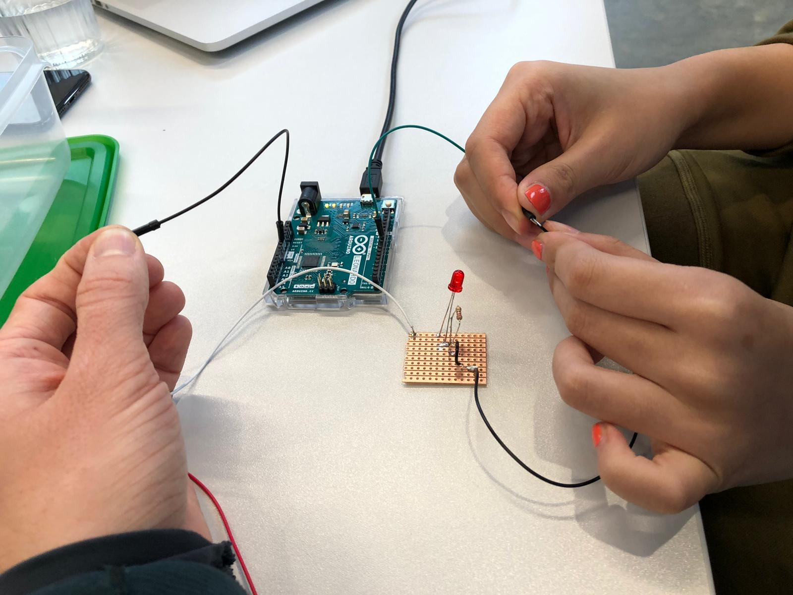
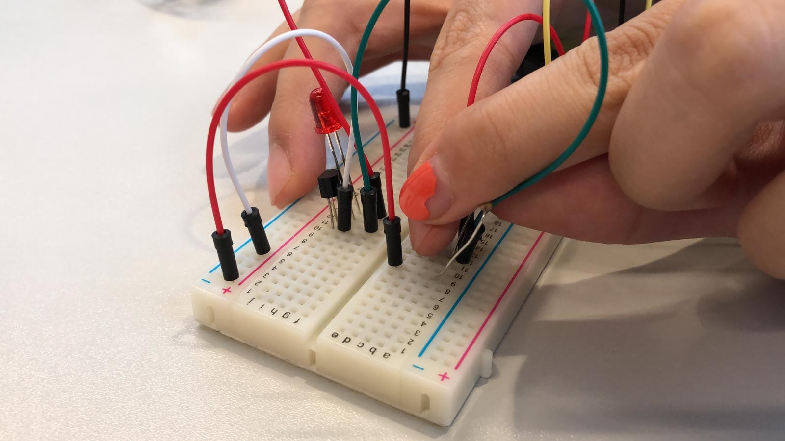
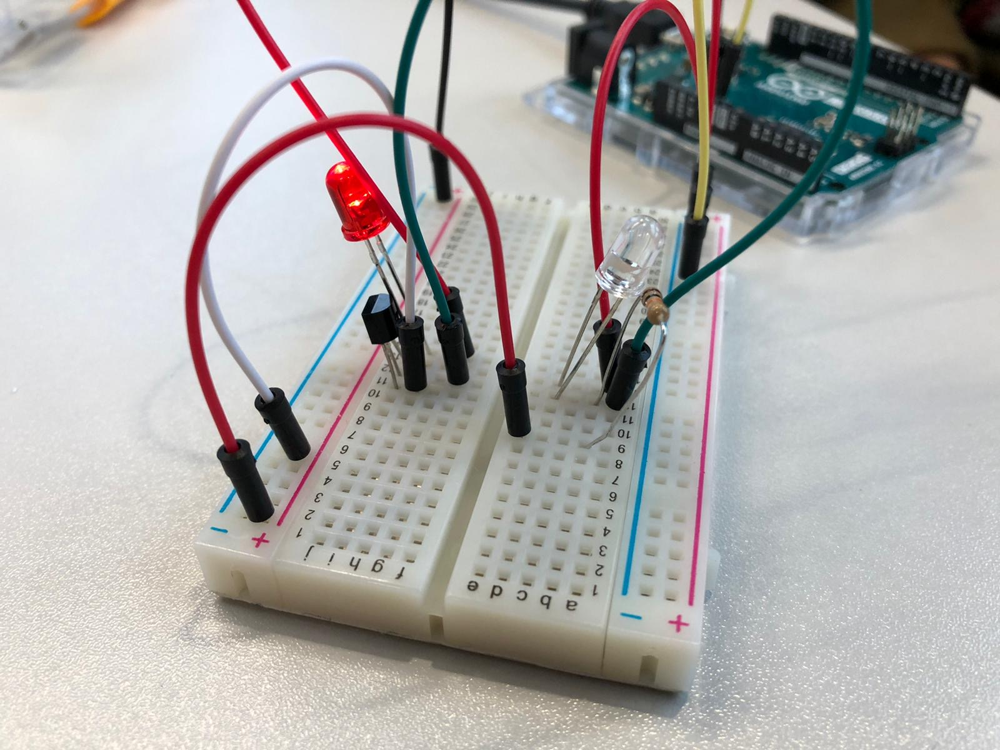

## Week 03 Lab Report

I paired with Stuart and we did the lab experiment together.

### Lab 01 - Building Your Own Circuit

###### VideoLink 
https://youtu.be/XKyXdch1t18

### Lab 02 - Potentiometer

----same as last week----

### Lab 03 - Dark Detecting LED

Sensors and transistors can be used to detecte the dynamic changes in the atmosphere in order to vary the input in the circuit. This circuit detects the amount of light in the room and react to it.

The circuit we built acted opposite to the way it should. The LED was on when light was light and off when it was dark. We connected the same as the circuit diagram shows, and did not know why this happpened.

    From nesxt lesson: Reversed result may cause by a reversed oriented element or a wrong relative positioning.

###### VideoLink 
https://youtu.be/ncrLFZBRUR4