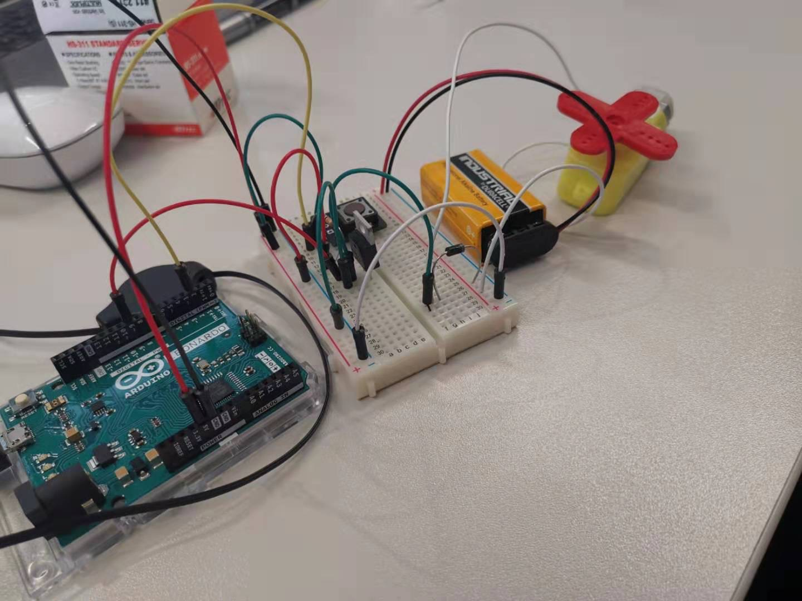
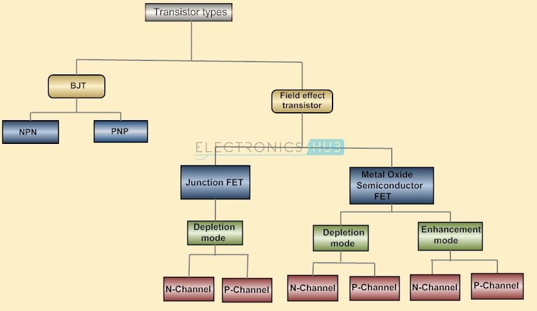
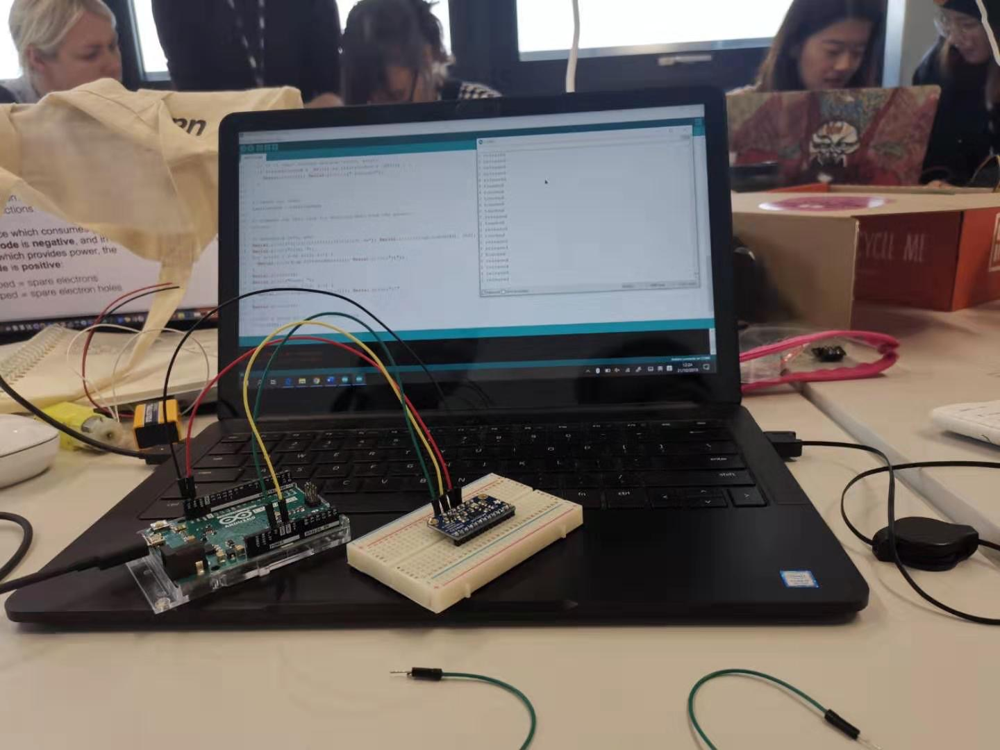

## Week 04 Lab Report

I grouped with Fiona and Lan for in-class labs.

### Lab 01 - Project Proposal

Because of my architecture background, the starting point for my final project is focing on space and spacial quality. I hope to design a device help people make better use of a space. Two options came accross my mind. One is that making a device detecting the change of people's behaviour in the room (in a larger area) and reflect on change in device. The change should aim at making the envrionment more suitable for a certain activity to happen. The other is to model a possible improvment of architectural spaces/facade from a more functional point of view. For example change of facade, structure according to external change (ie, wind, daylight). The risk of the conceptual model is that considering it as an art divice, output result in both cases may be subtle and not playful enough for people to engage.

I want to design a device that can change due to  movement created by the people inside. Since I want it to have a spacial effect, integrating light in to the output is my first choice, so that the light and shadow can create an impact from distance. The aim of the design is to make a space more interesting and attractive.

##### DOs and DON'Ts
- Let people engage.
- Not disturbing (imagine the device being placed in a public space).
- Hence, the divice should not be to noisy (audioly and visually).
- It is interesting if the people who interact are not the ones who observe.

##### Proposal

The aim of the my design is to create a visual dynamic effect depending on people's behaviour in a room. I am looking for a 'subtle interaction' which takes time for users to realise that they are causing the change(idealy). I hope the output effect can be relatively soft and can self-alter due to the activities happening in the space.

ie. light flashes when noise level is high; quicker in movement when faster flow of people is detected.

##### Possible inputs
- Motion sensor/ Light sensor. Directly sensing the movement in a small area, but sensitivity is an issue.
- Air flow. Abstract the motion as the air flow caused by motion.
- Sound. Directly detecting the sound level in a room.
- Footprint (pressure). Detecting people's actual footstep on certain spots.

##### Possible outputs
- Light. Creating a large scale visual effect with a relative small device.
- Motor/Servo. Controlling the movement of the device, creating more changeable visual effect.
- Strong air flow/ Magnetic field. Making the movment more dynamic and floating.

##### Refernences:

https://erskinesolarart.net/solar-light-art-installation-in-a-library/

http://www.stephenknapp.com/working

https://www.youtube.com/watch?v=XvkEExdl-w4

### Lab 02 - Hook up a Servo

We tried to alter the time intervals, the angle of rotations to test the physical possiblities of this servo.

Servo properties:

- A servo rotates at maximum of 360 degrees, in other words, it is not spinning, it is a divice for positioning angles.
- Give enough time for the servo to rotate to the right position (around 1000ms).

###### VideoLinks 

https://youtu.be/C7cO23GWPus
https://youtu.be/_NbO63XAYIo

### Lab 03 - Hook up a Moter

A moter is the divice that can spin around to give spiral effects. 

###### Question: What's the difference between a mosfet and transistor?
###### A: Mosfet is a common type of transistor. MOSFET = Metal Oxide Semiconductor Field Effect Transistor

*Diagram of transistor fammily tree from https://www.quora.com/What-is-the-difference-between-MOSFET-and-transistor*

###### Diode Protection

When a motor stops, the remaining magnetic field will keep on affecting the circuit, hence damage the divice. A diode in opposite direction of normal current flow can protect the divice from possible reversed currents.

###### VideoLinks

https://youtu.be/BC2kxgdoqP8
https://youtu.be/a5dVcIcuIXA

### Lab 04 - Hook up an MPR121

- Pysics Principles: Detecting change of capacity

###### VideoLink

https://youtu.be/K2TqWAhuaEQ

### Lab 05 - The Capsense library

- Changing states according to detected capacity change.
- Larger resistance means more sentitive the device is.
- A larger sensor resolution make the system more stable bue less sensible.
- Testing sensibility could be time consuming.
- #### Threshold

   Enables more complex programs to happen. Rather than merely detecting the numbers, the threshold setting controls the time ang behaviour when touching/ getting close to the foil.

###### VideoLinks
https://youtu.be/4IHJlPxtn2M

https://youtu.be/7WjzFR_WGa4
(Threshold)
